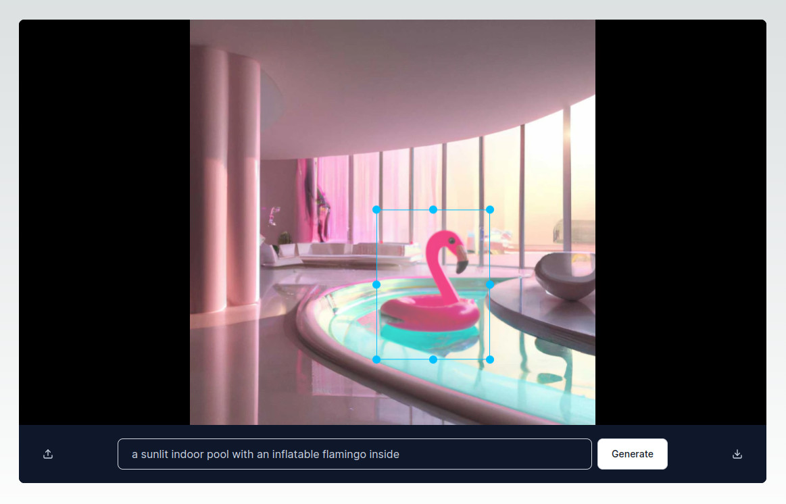

This is a Next.js 14 image editor powered by OpenAI's DALL-E 2 model. It lets users upload photos, select areas and edit them by writing prompts. The app comes with user accounts and is ready to accept payments with Stripe subscriptions.

Read the full step-by-step tutorial on how we built this app from scratch [here](https://reflowhq.com/learn/image-editor-dall-e-next).

# Getting Started

To run the app, follow these steps

1. `npm install` the dependencies in this folder
2. Duplicate the `.env.local.example` file and rename it to `.env.local`. Enter your Reflow project ID and OpenAI API key. You will also need a session secret key (run `openssl rand -hex 16` in the terminal to generate a random key).
3. Run `npx prisma generate` to generate the Prisma Client
4. Run `npx prisma migrate dev` to create the database
5. Start the development server with `npm run dev`
6. Open [http://localhost:3000](http://localhost:3000) with your browser to see the app running.
